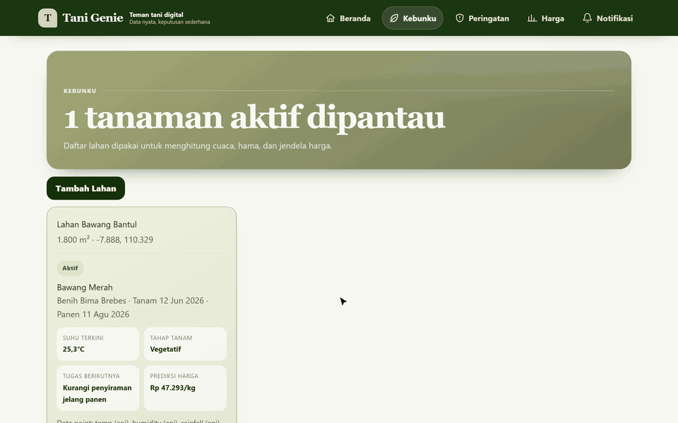
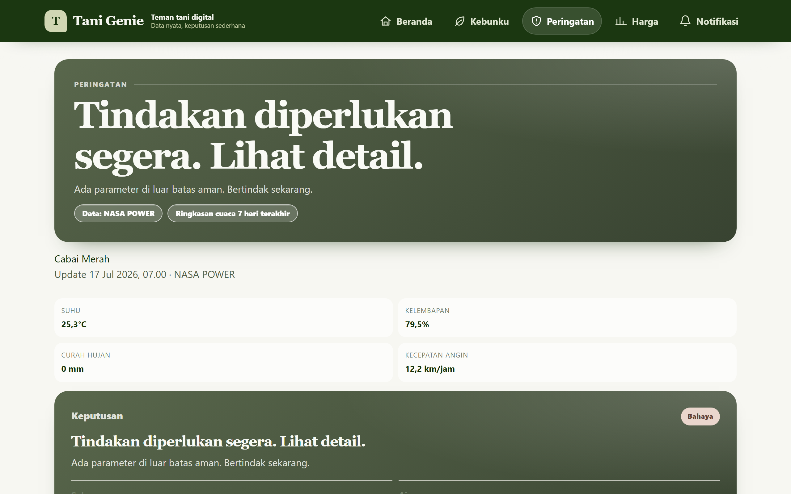
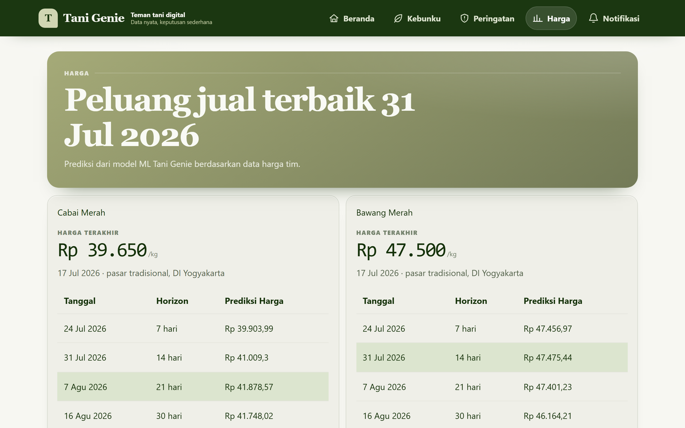
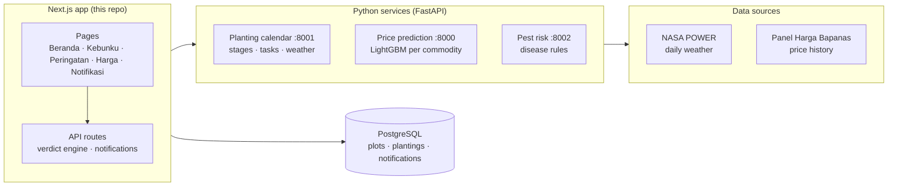
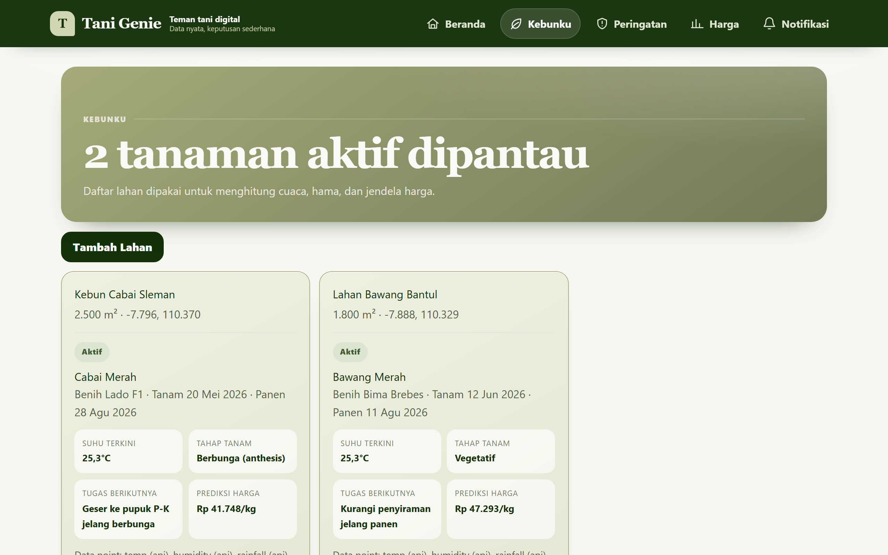
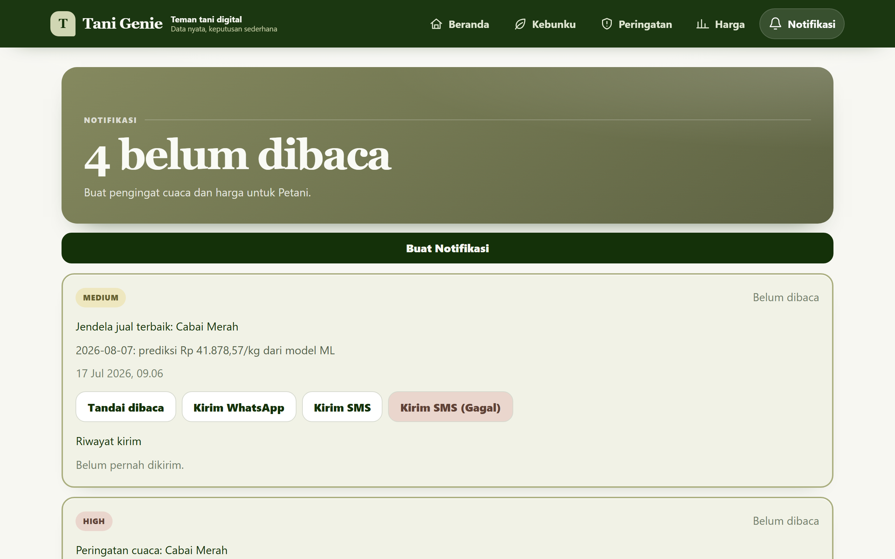
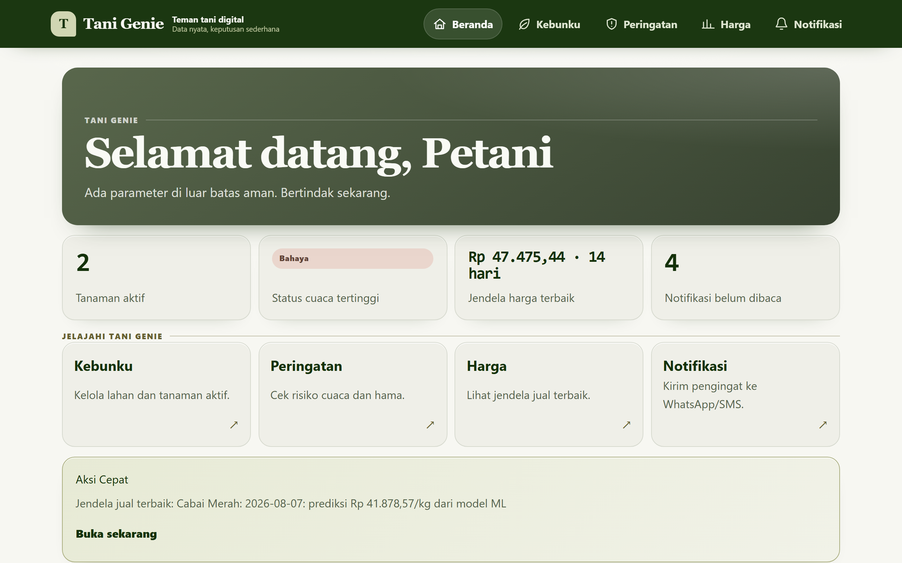

# Tani Genie

A climate and price decision companion for Indonesian smallholder farmers.

[Walkthrough](docs/media/walkthrough.gif) · [Screens](#highlights) · [Run it locally](#run-it-locally) · [Architecture](#how-it-works)



Tani Genie tells a farmer what to do today for each plot: water, spray, wait, or sell. It combines real daily weather, a crop calendar, disease-risk rules, and a machine-learning price forecast into one verdict per planting. The UI is mobile first and in Bahasa Indonesia. It was built at GarudaHacks 2026.

## Why it works this way

- **One decision, not a dashboard.** Each page opens with one sentence: the verdict and the action. The numbers behind it (temperature, humidity, rainfall, wind, forecast table) come second, for the farmer who wants to check.
- **Every model is optional.** The calendar and weather, price, and disease-risk models each run as a separate FastAPI service with its own data pipeline. The web app calls them independently and treats each one as optional. When a service is down, its card says "Belum tersedia" and the rest of the app keeps working. The app never fills a gap with invented data.

## Highlights

- **Weather verdicts per planting.** Peringatan compares NASA POWER daily weather at the plot's coordinates with the crop's limits. It rates temperature, water, pest risk, and spray window as Aman, Pantau, or Bahaya, then states one action.
- **Crop calendar.** Kebunku shows the current growth stage and the next task, counted from the planting date. The calendar covers rice, shallot, garlic, red chili, and bird's-eye chili.
- **Sell window from an ML model.** Harga forecasts the price 7, 14, 21, and 30 days ahead and marks the best day to sell. One LightGBM model per commodity learns from Panel Harga Bapanas prices across 4 market levels and 34 provinces.
- **Disease-risk flags.** The pest-risk service scores onion downy mildew, rice blast, chili Phytophthora blight, and chili anthracnose from recent weather. The output is a flag for field inspection, not a diagnosis.
- **Reminders.** Notifikasi turns verdicts and forecasts into prioritized reminders, with a WhatsApp and SMS delivery log. Delivery is simulated.
- **Per-planting data sources.** Each planting records whether temperature, humidity, rainfall, soil moisture, and pH come from the weather API or the farmer's own IoT sensor.





## How it works



- **Weather** comes from NASA POWER through the planting calendar service: the latest complete day of temperature, rainfall, humidity, and wind. The app also fetches the recent daily history from NASA POWER and sends it to the pest-risk service.
- **Verdicts** come from `src/modules/insights/verdict-engine.ts`, which compares the reading with the limits in the crop catalog.
- **Prices** come from the price-prediction service. It forecasts recursively from the last known price, for up to 30 days.
- **Calendar stages and tasks** come from the crop knowledge base in the planting calendar service.

## Tech stack

| Layer | Tools |
|---|---|
| Web app | Next.js 16 (App Router), React 19, TypeScript 5 (strict), Tailwind CSS 4 |
| Data | PostgreSQL, Prisma 7, Zod |
| Services | Python, FastAPI, pandas, LightGBM, scikit-learn |
| Quality | Vitest, Biome, Playwright (media capture) |

## Run it locally

There is no hosted demo. Every page needs PostgreSQL, and most need the three Python services.

Prerequisites: Node.js 24+, pnpm (`corepack enable pnpm`), PostgreSQL, Python 3.11+.

1. Install and configure the web app:

   ```bash
   pnpm install
   cp .env.example .env    # then set DATABASE_URL
   pnpm db:generate
   pnpm db:push
   pnpm db:seed            # syncs the crop catalog
   ```

2. Start the three services. Each one lives on its own branch of this repo:

   | Service | Branch | Start | Port |
   |---|---|---|---|
   | Price prediction | `price-predictor` | `pip install -r requirements.txt`, `bash scripts/run_pipeline.sh` (builds the dataset and trains the models), `uvicorn api.main:app --port 8000` | 8000 |
   | Planting calendar | `aubrey/planting_calendar` | `cd backend`, `pip install -r requirements.txt`, `uvicorn app.main:app --port 8001` | 8001 |
   | Pest risk | `baru` | `pip install -r requirements.txt`, `pip install -e .`, `PYTHONPATH=src uvicorn pest_risk.api.main:app --port 8002` | 8002 |

   Check out each branch in its own folder, for example `git worktree add ../tani-genie-price origin/price-predictor`. Without trained models, the pest-risk service uses its rule-based fallback. See that branch's README for training.

3. Start the app and open http://localhost:3000:

   ```bash
   pnpm dev
   ```

The service URLs, market, province, and per-service timeouts are in `.env.example`. Each price prediction takes about one second, and the Harga page requests four per planting. The example sets `PRICE_API_TIMEOUT_MS` to 20 s so that several plantings fit.

To regenerate the README media after a UI change, run `python scripts/capture_media.py` against the running stack. The script docstring explains the capture date.

## Using the app

1. **Kebunku.** Add a plot (name, area; the location defaults to Yogyakarta or uses the device location). Add a planting with crop, seed, target yield, and planting and harvest dates. The plot card then shows the current temperature, growth stage, next task, and predicted price.

   

2. **Peringatan.** Read the verdict and action for each planting, then the weather readings and disease-risk flags behind it.
3. **Harga.** Read the forecast table per planting. The highlighted row is the best day to sell.
4. **Notifikasi.** Select **Buat Notifikasi** to create reminders from the current verdicts and forecasts. Send each one by WhatsApp or SMS, or force a failure to see the error path.

   

5. **Beranda.** The dashboard shows active plantings, the worst weather status, the nearest sell window, and unread reminders.

   

### API endpoints

| Method | Endpoint | Description |
|--------|----------|-------------|
| GET | /api/health | App and database status |
| GET | /api/crops | List crops |
| POST | /api/crops | Add a crop definition |
| GET | /api/plots | List plots |
| POST | /api/plots | Add a plot |
| GET | /api/plots/[id] | Plot detail |
| PATCH | /api/plots/[id] | Update a plot |
| DELETE | /api/plots/[id] | Delete a plot (no active planting) |
| GET | /api/plantings | List plantings (?plotId=) |
| POST | /api/plantings | Add a planting |
| PATCH | /api/plantings/[id] | Update a planting, for example `{status: "finished"}` |
| GET | /api/plantings/[id]/integrations | Planting calendar and price prediction |
| GET | /api/insights/weather | Weather verdict (?plantingId=) |
| POST | /api/insights/weather/refresh | Refresh weather |
| GET | /api/insights/pest-risk | Disease-risk flags (?plantingId=) |
| GET | /api/forecasts/prices | Price forecast (?plantingId=) |
| POST | /api/forecasts/prices/refresh | Refresh the forecast |
| GET | /api/notifications | List notifications |
| POST | /api/notifications/generate | Create notifications |
| PATCH | /api/notifications/[id]/read | Mark as read |
| GET | /api/notifications/[id]/deliveries | Delivery history |
| POST | /api/notifications/[id]/deliveries | Send (body: `{channel, forceFail?}`) |

Successful weather, calendar, price, and pest-risk responses stay in server memory for a few minutes. The **Segarkan** button forces a fresh fetch.

### Testing

```bash
pnpm typecheck    # TypeScript strict check
pnpm lint         # Biome lint and format
pnpm test         # unit and route tests (Vitest)
pnpm build        # production build
```

### Limits

- **Price data ends 2026-07-17.** The price service refuses forecasts more than 30 days past its last known price, so Harga shows "belum tersedia" until someone adds newer price data and retrains. The README media were captured as of 2026-07-17.
- **Messages are not sent.** WhatsApp and SMS delivery is simulated and only writes the delivery log.
- **One farmer, no login.** The app uses a single default farmer.
- **Disease risk is rule based.** Trained pest-risk models need a private dataset that the repo does not include.

## Credits

Built at GarudaHacks 2026 by:

- **Aditya Rahman**: Next.js web app, API, database schema, and service integration
- **Andi Nabil Safaraz**: pest and disease risk service
- **Samudera Aubreyasta**: planting calendar service
- **Tani Genie team**: price prediction service

## License

[MIT](LICENSE)
